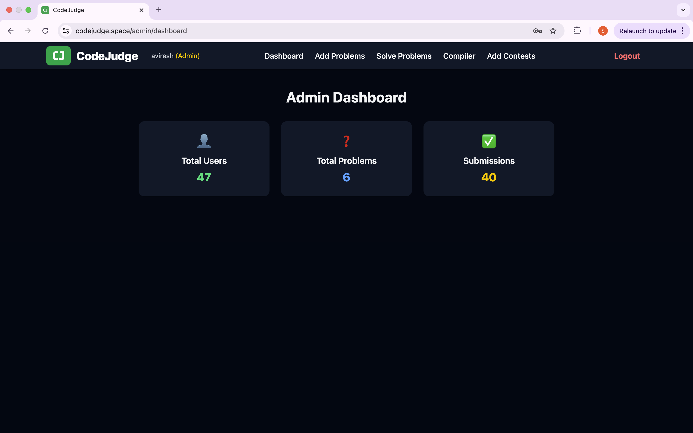
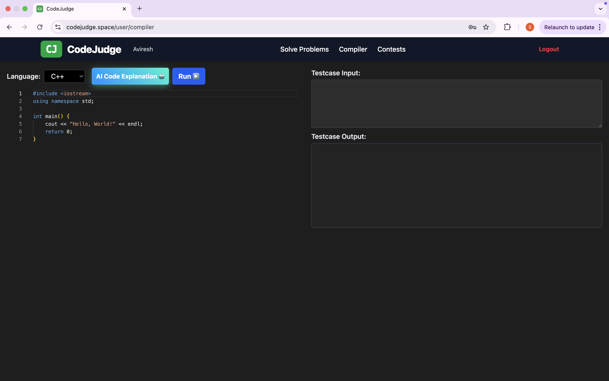
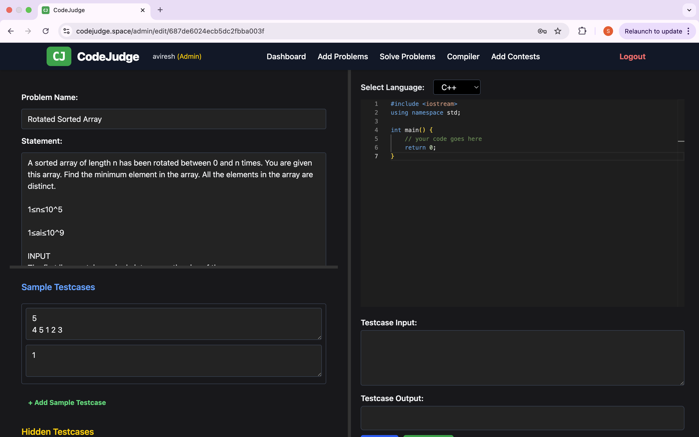
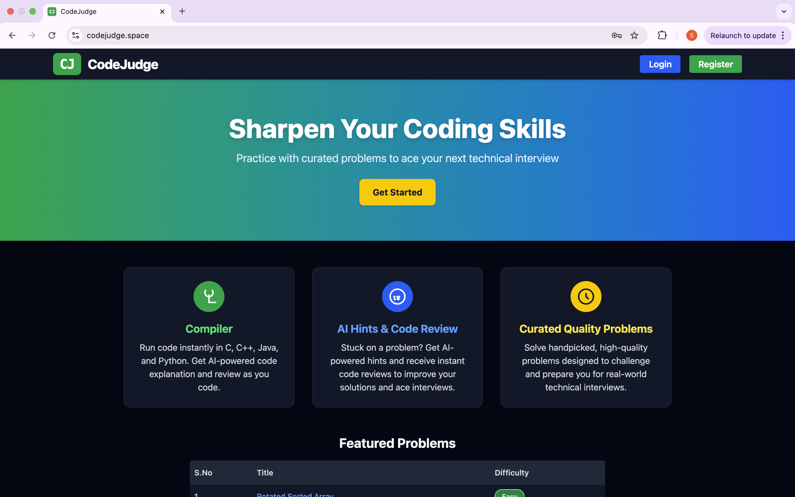
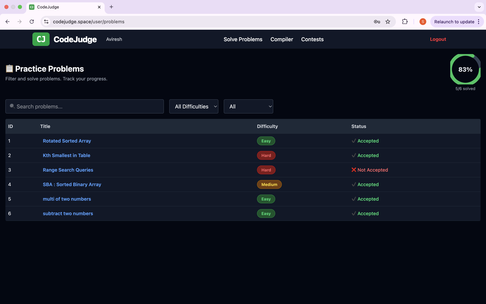
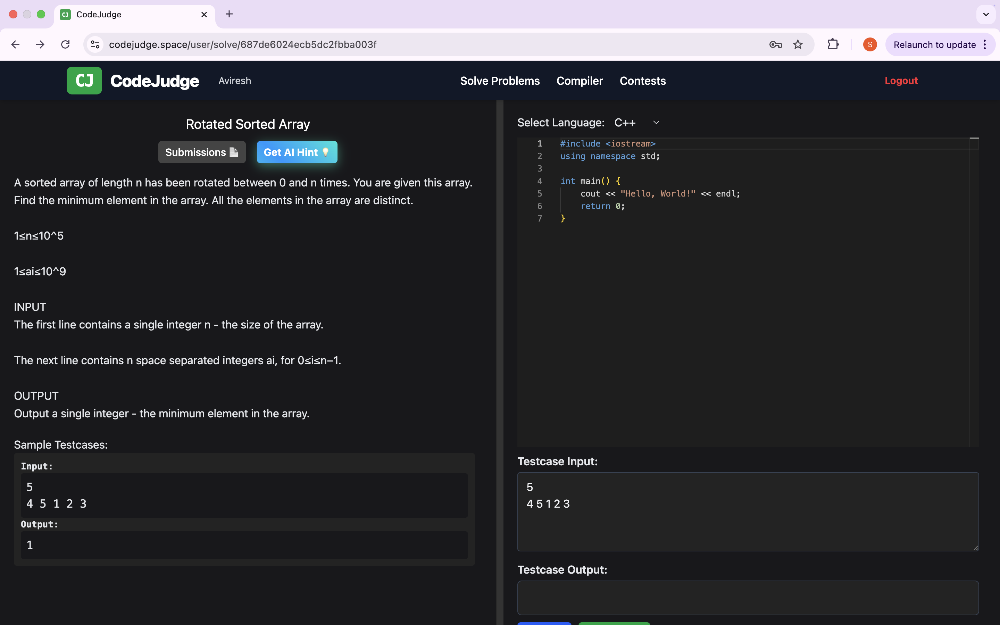
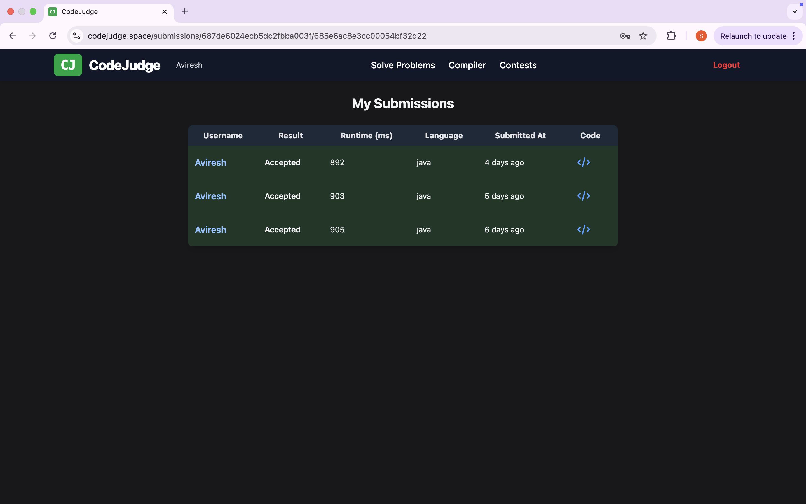

# Code Judge

## Description

Code Judge is a full-stack online coding platform that enables users to solve programming problems, submit code in multiple languages, and receive instant feedback. The platform features secure user authentication, an admin dashboard for problem management, and a Dockerized backend compiler service.

---

## Technologies Used

- **Frontend:** React, Tailwind CSS, Vite
- **Backend:** Node.js, Express, MongoDB
- **Compiler Service:** Node.js, Docker
- **Authentication:** JWT, bcrypt
- **Deployment:** Vercel (Frontend), Render/AWS (Backend/Compiler)

---

## Key Features

- User registration and login
- Browse and solve coding problems
- Submit code in C, C++, Java, and Python
- Instant feedback on code submissions
- View submission history and statistics
- Admin dashboard for problem and user management
- Secure, Dockerized code execution
- Responsive and modern UI

---

## Screenshots









---

## Installation & Setup

1. **Clone the repository:**
    ```bash
    git clone https://github.com/sai172624/OJ-project.git
    cd OJ-project
    ```

2. **Install dependencies for each service:**
    ```bash
    cd frontend
    npm install
    cd ../backend
    npm install
    cd ../compiler
    npm install
    ```

3. **Set up environment variables:**
    - Edit the `.env` file in each service (`frontend`, `backend`, `compiler`) and configure as needed.

4. **Start the services:**
    ```bash
    # Start backend
    cd backend
    npm start

    # Start compiler (requires Docker)
    cd ../compiler
    npm start

    # Start frontend
    cd ../frontend
    npm run dev
    ```

---

## Usage

- Visit the homepage to browse available problems.
- Register or log in to your account.
- Select a problem, write your solution in the code editor, and submit.
- View feedback and your submission history.
- Admins can log in to manage problems and users.

---

## Live Demo

[https://www.codejudge.space/](https://www.codejudge.space/)

## Demo Video

[https://www.loom.com/share/d1e8b01098764a18a1bd2bb970707fe9](https://www.loom.com/share/d1e8b01098764a18a1bd2bb970707fe9)

## Project Repository

[https://github.com/sai172624/OJ-project](https://github.com/sai172624/OJ-project)

---

## License

MIT License

---

## Contributors & Acknowledgments

- Developed and maintained by Aviresh Laxman Sai.
- Special thanks to all open-source libraries and tools used.
